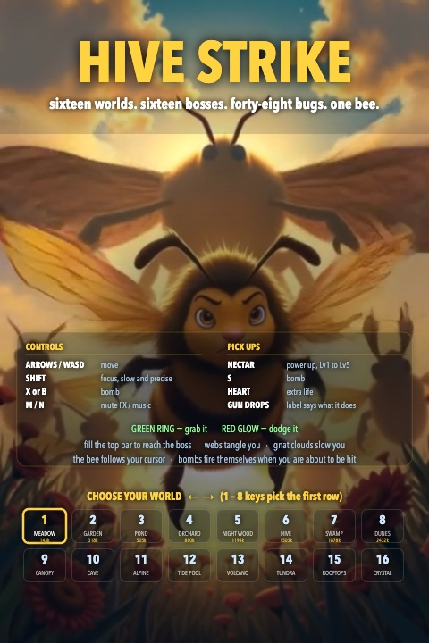
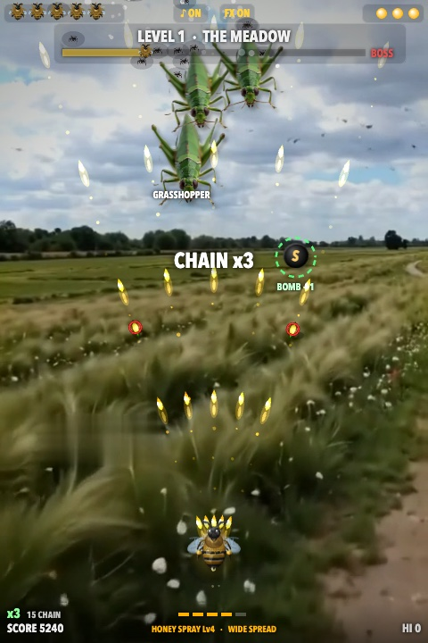
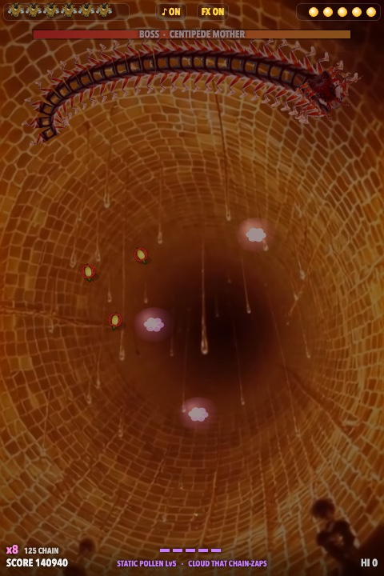
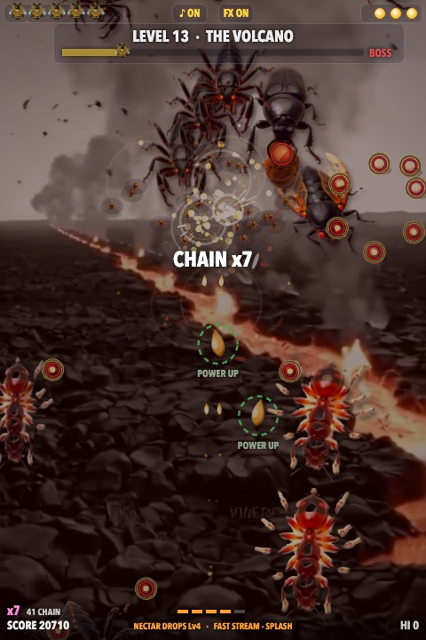
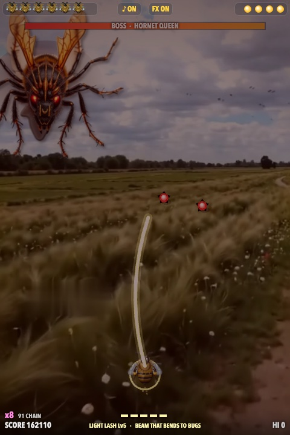
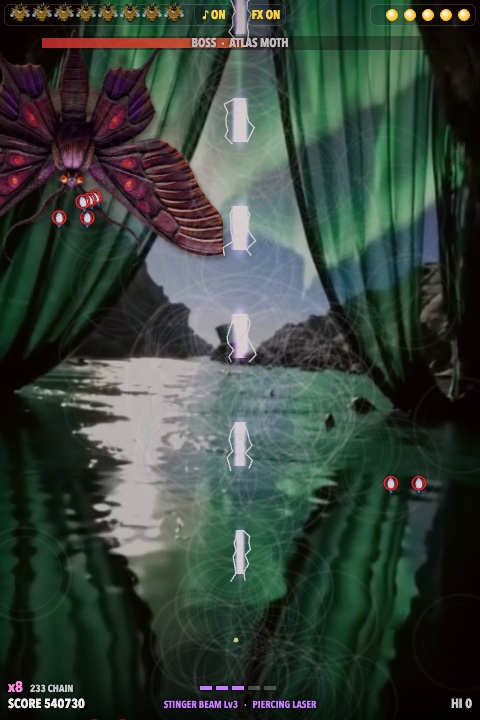
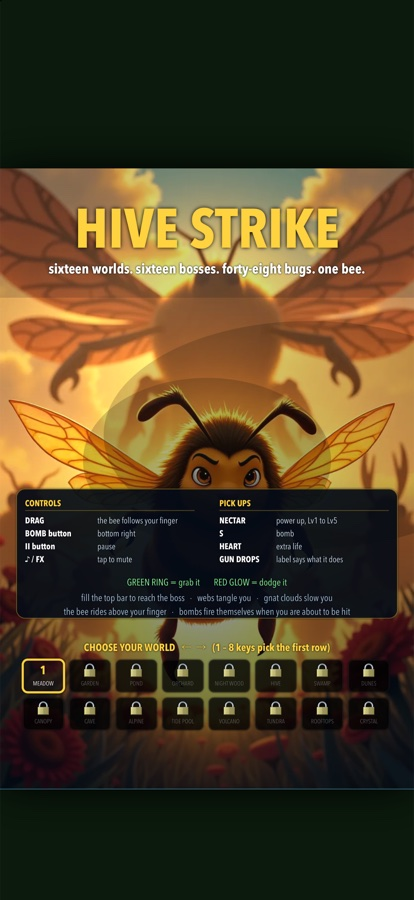

# Hive Strike

A vertical bug shooter. You are one bee. Sixteen worlds, sixteen bosses, forty-eight
kinds of insect, and every single asset in it was generated on the Mac sitting on my desk.

<p align="center">
  
</p>

<p align="center">
  
  
  
</p>

<p align="center">
  
  
</p>

*Real frames, straight off the canvas. Nothing here is a mockup.*

<p align="center">
  
  <br><em>Running as a native app on an iPhone 17 Pro. The controls panel reads
  differently on a phone because the game knows it is on one.</em>
</p>

## Made entirely with local AI

No cloud API was called to make this game. Everything below ran on one Mac, offline,
under a memory broker that made the models take turns instead of fighting over RAM.

| Asset | Model | What it made |
|---|---|---|
| Bug + boss sprites | **FLUX.1-dev** (fp8, ComfyUI) | 48 insects and 16 bosses, each rendered as a photoreal top-down macro shot on pure white, then keyed to an alpha PNG |
| Level backgrounds | **FLUX.1-dev** | 16 painted bird's-eye scenes, one per world, in one consistent style |
| Depth parallax | **Depth-Anything-V2-Small** | Each painting is measured for depth once, then drawn in 32 strips that slide with the bee: the flowers at your feet move further than the hills. No video, no extra assets, ~2 KB of numbers |
| Music | **ACE-Step 1.5**, driven by my own Song Forge | 16 level beds and 16 boss themes, a different genre per world, so no two levels sound alike |
| Sprite QC | **Qwen3-VL-32B-Instruct** (4-bit MLX) | Every sprite has to be stored head-down. Pixel heuristics scored 50%, so I asked a model that can actually see the insect |
| Sound effects | none — hand-written Web Audio | 49 individual bug voices, every one synthesized live from oscillators and filtered noise. No sample files at all |

The generators are all in [`tools/`](tools/) if you want to see how any of it was done.
They are ordinary Python scripts, not a framework.

Credit where it is due: Black Forest Labs for FLUX, the Depth Anything team, the ACE-Step
team, and the Qwen team. ComfyUI does the heavy lifting for the image side. I just
pointed them at bugs.

## Playing it

Open `index.html`. That is the whole install.

| | |
|---|---|
| **Move** | Arrows / WASD, or just drag — the bee follows your cursor or finger |
| **Slow, precise** | Shift |
| **Bomb** | X, or B, or tap |
| **Pause** | P |
| **Mute** | M for effects, N for music |
| **Controller** | Stick or d-pad to move, A/B/RB to bomb, LT/LB for precision, Start to pause |

Firing is automatic. The interesting decisions are where you stand, when you bomb, and
whether you chase the green rings.

## How it is built

Canvas 2D. No engine, no framework, no dependencies. The game ships as a single
`index.html` with the assets beside it in `art/` and `music/`.

You edit it in `src/` though — twenty-one files split at the code's own section
boundaries (`01_audio.js`, `11_bosses.js`, `14_update.js`, and so on) instead of one
1,600-line scroll. `python3 tools/assemble.py` concatenates them back into
`index.html`. The join is plain concatenation in filename order, so the result is
byte-identical to what the pieces came from — the splitter refused to write until it
had proved that, and `assemble.py` prints the before/after hash every time it runs.

The loop is a fixed 60 Hz accumulator with a spiral-of-death clamp, so the game runs at
the same speed on a 60 Hz laptop and a 120 Hz display. Backgrounds are loaded in a
sliding window around the live level rather than all at once. When the tab or the phone
goes to sleep, the game, the music and the audio context all suspend together,
and you come back to a 3-2-1 countdown instead of dropping into a boss fight already
taking hits.

## Testing

```
node tools/test_walkthrough.mjs
```

Drives a headless browser through all 16 levels — normal play, the boss warning card, the
fight, the rage phase, the kill — and reports JS errors and draw time per frame. Current
run: 16/16 levels to the win screen, 0 errors, 0.36 ms/frame.

## Shipping to phones

`ios/` and `android/` are Capacitor shells around the same `dist/` build. See
[docs/SHIPPING.md](docs/SHIPPING.md) for the build loop, what the compression does
(source assets become a ~43 MB bundle), and what is
still needed before either store will accept it.

The iOS app builds and runs today. Android is scaffolded and portrait-locked but
needs Android Studio and a JDK installed to compile.

## Twenty seconds of it

https://github.com/nicedreamzapp/hive-strike/raw/main/media/gameplay.mp4

Level 12, the Tide Pool. Also on the [product page](https://nicedreamzwholesale.com/software/hive-strike/).

## Status

**Live on Google Play** — [Hive Strike](https://play.google.com/store/apps/details?id=com.nicedreamz.hivestrike).
Free for thirty days, then a one-time $1.99 unlock, no subscription and no adverts.
The iPhone build is with App Review.
